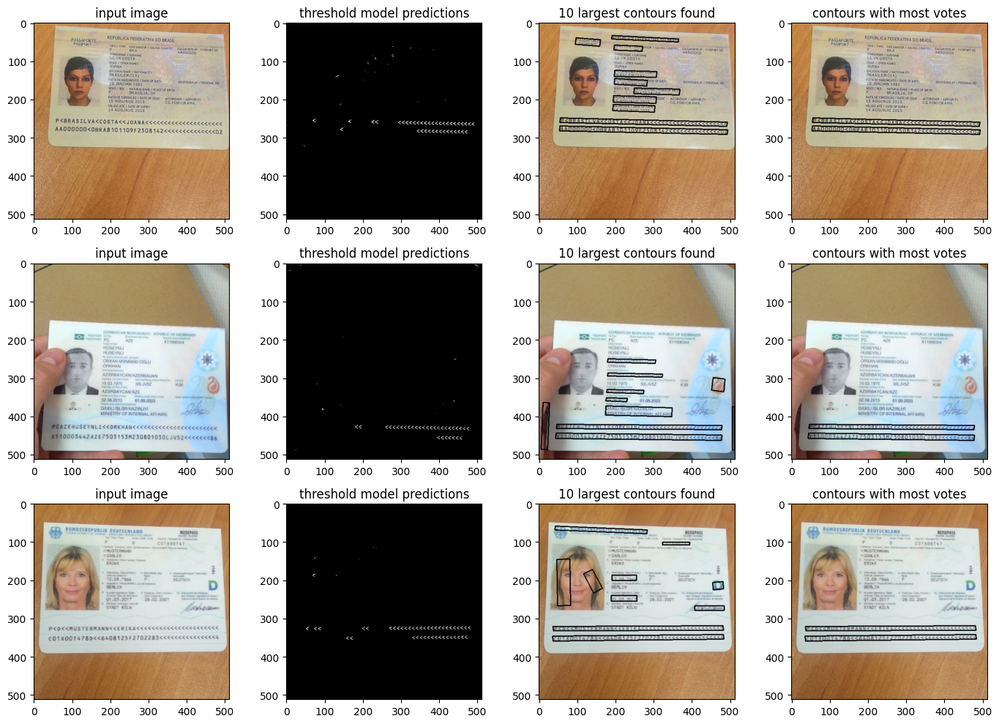

# MRZ Text Detection

This repository provides a solution for detecting the lines of text in
the machine-readable zone (MRZ) of identity documents such as
passports or ID cards.

## Approach

The approach used in this repository is to utilize the angle brackets
that represent whitespaces in a MRZ as a guide. A neural network
that performs image segmentation is trained to locate all angle
brackets within an image. The network is optimized for small size and
efficiency, making it a suitable solution for usage on a smartphone.

Using the positions of the identified angle brackets, the full text lines
in the MRZ are accurately identified. The repository offers multiple
algorithmic solutions for this task.

The solution is designed to work even in challenging conditions such as
poor lighting or image shake, and is specifically tailored to work with
photos taken by a smartphone camera of passport.

## Validation

The solution has been validated using the Mobile Identity Document Video
(midv500) dataset which comprises 500 video clips for 50 different identity
document types. 

## Challenges
A unique challenge in this task is the absence of a
dataset for angle bracket segmentation. To overcome this,
synthetic training data was generated by generating random patterns
of angle brackets, applying random perspective shifts, printing them
on real backgrounds and adding noise.

## Visualization

The following images demonstrate the desired visual representation of the input, intermediate steps, and final output:

Input image:


Angle bracket segmentation mask:


Final output:


The figure below illustrates the process of our pipeline in identifying MRZ lines, including the intermediate steps involved.




## Usage

The Jupyter notebook mrz-solution.ipynb provides a comprehensive
walkthrough of the solution, feel free to experiment with it.

## Dependencies

The following libraries were used for implementation and visualization

- numpy
- tensorflow
- keras
- opencv
- pillow
- scikit-learn
- matplotlib


## Installation

```
git clone https://github.com/rechargeable22/mrz-text-detection
cd mrz-text-detection
pip install -r requirements.txt
```

## Contributing

Pull requests are welcome. For major changes, please open an issue first to discuss what you would like to change.

## License

MIT